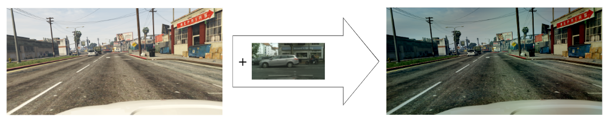
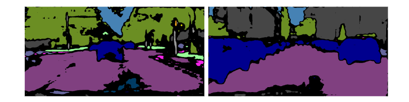

# Real-time Domain Adaptation in Semantic Segmentation

This repository contains the code of our project for the course "Advanced Machine Learning" at Politecnico di Torino. The goal of the project is to become familiar with the domain adaptation problem in the context of semantic segmentation, by implementing and testing different strategies.

#### AUTHORS
- s317320 - Buccoliero Elena
- s309234 - Chiabodo Alessandro
- s314971 - Occhiena Beatrice

## Project structure
- `datasets/`: classes to handle the datasets used in the project.
  - [Cityscapes](datasets/cityscapes.py)
  - [GTA5](datasets/gta5.py)

- `model/`: implementation of the models used in the project and their components.
  - [BiSeNet](model/model_stages.py)
    - AttentionRefinement module
    - ContextPath module
    - FeatureFusion module
  - [BiSeNet Discriminator](model/model_stages.py)
  - [STDCNet813 Backbone](model/stdcnet.py)

- `training/`: code to implement the different training strategies used in the project.
  - [Simple Training](training/simple_train.py) - Trains the model on the source domain and tests it on the target domain.
  - [Single Layer Domain Adaptation](training/single_layer_da_train.py) - Performs unsupervised adversarial training with labeled synthetic data and unlabelled real-world data.
  - [Fourier Domain Adaptation](training/fda_train.py) - Performs semi-supervised training using the enhanced synthetic data generated by FDA.
  - [Self-Learning](training/fda_self_learning_train.py) - Performs self-learning using pseudo-labels generated by the model adapted with MBT.

- `utils/`: utility functions and classes used in the various stages of the project.
  - [General Functions](utils/general.py) - Various utility functions, Save and Load Checkpoints
  - [Data Augmentation](utils/aug.py) - Various Transformations
  - [FDA](utils/fda.py) - Style Transfer functions, Entropy Minimization Loss
    - MBT Adaptation
    - Pseudo-Label Generation

- `eval.py`: code to evaluate the performance of the models on the target domain.
- `main.py`: code to initialize the training/testing process according to the chosen arguments.
- `test.ipynb`: code to perform a quick test of some of the implemented functions.

## Requirements
- The two datasets are not included in the repository, but they can be downloaded from [datasets_drive_link](https://drive.google.com/drive/u/0/folders/1iE8wJT7tuDOVjEBZ7A3tOPZmNdroqG1m).
- The pre-trained weights for STDCNet813 are available at [stdcnet_drive_link](https://drive.google.com/drive/folders/1wROFwRt8qWHD4jSo8Zu1gp1d6oYJ3ns1).

## Steps
1. **RELATED WORKS** - Read the papers and understand the methods.
2. **TESTING REAL-TIME SEMANTIC SEGMENTATION**
    - > A - Define the upper bound for the domain adaptation phase.
    
      Train the model on the the training set of Cityscapes and evaluate it on the validation set of Cityscapes.

    - > B - Train on the synthetic dataset.
    
      Train the model on the training set of GTA5 and evaluate it on the validation set of GTA5.

    - > C1 - Evaluate the domain shift.

      Test the model trained at step B on the validation set of Cityscapes.

    - > C2 - Evaluate the domain shift performing data augmentation.

      Train the model on the training set of GTA5 using data augmentation (probability 0.5) and evaluate it on the validation set of Cityscapes.

3. **IMPLEMENTING UNSUPERVISED ADVERSARIAL DOMAIN ADAPTATION** - Perform adversarial training with labeled synthetic data (GTA5) and unlabelled real-world data (Cityscapes). Evaluate the model on the validation set of Cityscapes.

4. **IMPROVEMENTS - option c**

    - > A - Implement a fast image-to-image translation algorithm like FDA.
    
      Apply FDA to enhance the GTA5 training images, i.e. swap the low-frequency components of the Fourier amplitude spectra of the source and target images. The parameter *beta* controls the size of the low frequency window to be replaced.

      Train the model with labeled enhanced synthetic data from GTA5 and unlabelled real-world data from Cityscapes (semi-supervised learning). Evaluate the model on the validation set of Cityscapes. 
      
    - > B - Evaluate the performance of the Segmentation Network adapted with MBT.

      Multi-band Transfer consists in using the mean prediction of different segmentation networks trained with different spectral domain sizes (betas).

      Evaluate the model on the validation set of Cityscapes.

    - > C - Implement a self-learning approach.

      Generate pseudo-labels for the training set of Cityscapes using the predictions of the model adapted with MBT. To avoid overfitting, filter out the low-confidence predictions.

      Train the model with labeled synthetic data from GTA5 and pseudo-labeled real-world data from Cityscapes. Evaluate the model on the validation set of Cityscapes.

    - > D - Evaluate the performance of the Segmentation Network trained with self-learning adapted with an additional step of MBT.

      Evaluate the model on the validation set of Cityscapes.

## Commands and Results

4. **IMPROVEMENTS - option c**
    - A - Implement a fast image-to-image translation algorithm like FDA.
      
      Example of style transfer with beta=0.05
      ```bash
      main.py --dataset CROSS_DOMAIN --data_transformations 0 --batch_size 5 --learning_rate 0.01 --num_epochs 50 --save_model_path trained_models\norm_fda0.09 --resume False --comment norm_fda0.09 --mode train_fda --num_workers 4 --optimizer sgd --beta 0.09
      ```
      ```bash
      main.py --dataset CROSS_DOMAIN --data_transformations 0 --batch_size 5 --learning_rate 0.05 --num_epochs 50 --save_model_path trained_models\norm_fda0.05 --resume False --comment norm_fda0.05 --mode train_fda --num_workers 4 --optimizer sgd --beta 0.05
      ```
      ```bash
      main.py --dataset CROSS_DOMAIN --data_transformations 0 --batch_size 5 --learning_rate 0.01 --num_epochs 50 --save_model_path trained_models\norm_fda0.01 --resume False --comment norm_fda0.01 --mode train_fda --num_workers 4 --optimizer sgd --beta 0.01
      ```
      | beta | Accuracy _(%)_ | mIoU _(%)_ | Train Time (avg per-epochs) |
      |------|----------------|------------|-----------------------------|
      | 0.01 | xxxx           | xxxx       | xxxx                        |
      | 0.05 | xxxx           | xxxx       | xxxx                        |
      | 0.09 | xxxx           | xxxx       | xxxx                        |
    
    - B - Evaluate the performance of the Segmentation Network adapted with MBT.
      ```bash
      main.py --dataset CROSS_DOMAIN --mode test_mbt --fda_b1_path trained_models\norm_fda0.01\best.pth --fda_b2_path trained_models\norm_fda0.05\best.pth --fda_b3_path trained_models\norm_fda0.09\best.pth
      ```
      | Accuracy _(%)_ | mIoU _(%)_ |
      |----------------|------------|
      | xxxx           | xxxx       |
    - C - Implement a self-learning approach.
      ```bash
      main.py --dataset CROSS_DOMAIN --data_transformation 0 --mode save_pseudo --fda_b1_path trained_models\norm_fda0.01\best.pth --fda_b2_path trained_models\norm_fda0.05\best.pth --fda_b3_path trained_models\norm_fda0.09\best.pth --save_pseudo_path dataset\Cityscapes\pseudo_label
      ```
      

      Example of pseudo-labels generated by the model
      
      ```bash
      main.py --dataset CROSS_DOMAIN --data_transformations 0 --batch_size 5 --learning_rate 0.01 --num_epochs 50 --save_model_path trained_models\selflearn_fda0.01 --resume False --comment selflearn_fda0.01 --mode self_learning --num_workers 4 --optimizer sgd --beta 0.01
      ```
      ```bash
      main.py --dataset CROSS_DOMAIN --data_transformations 0 --batch_size 5 --learning_rate 0.05 --num_epochs 50 --save_model_path trained_models\selflearn_fda0.05 --resume False --comment selflearn_fda0.05 --mode self_learning --num_workers 4 --optimizer sgd --beta 0.05
      ```
      ```bash
      main.py --dataset CROSS_DOMAIN --data_transformations 0 --batch_size 5 --learning_rate 0.01 --num_epochs 50 --save_model_path trained_models\selflearn_fda0.09 --resume False --comment selflearn_fda0.09 --mode self_learning --num_workers 4 --optimizer sgd --beta 0.09
      ```
      | beta | Accuracy _(%)_ | mIoU _(%)_ | Train Time (avg per-epochs) |
      |------|----------------|------------|-----------------------------|
      | 0.01 | xxxx           | xxxx       | xxxx                        |
      | 0.05 | xxxx           | xxxx       | xxxx                        |
      | 0.09 | xxxx           | xxxx       | xxxx                        |

    - D - Evaluate the performance of the Segmentation Network trained with self-learning adapted with an additional step of MBT.
      ```bash
      main.py --dataset CROSS_DOMAIN --mode test_mbt --fda_b1_path trained_models\selflearn_fda0.01\best.pth --fda_b2_path trained_models\selflearn_fda0.05\best.pth --fda_b3_path trained_models\selflearn_fda0.09\best.pth
      ```
      | Accuracy _(%)_ | mIoU _(%)_ |
      |----------------|------------|
      | xxxx           | xxxx       |
   
